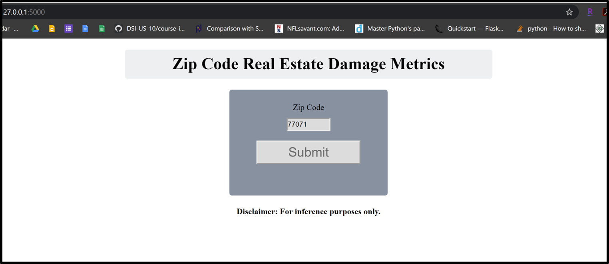

# Extracting the Impact on Real Estate Sale Prices Following a Hurricane
This project represents a pro bono academic collaboration between General Assembly DSI10-BOS and New Light Technologies.
```
├── DSI_group_project_hurricane_impact
    ├── visuals
        ├── fooooo.png
    ├── README.md
    ├── foo.ipynb
    └── presentation.pdf
```
## Problem Statement

During a disaster, it is important to model and estimate the potential or forecasted effect of the event, including the projected/forecasted damage.
Existing indicators of forecasted damage include number of structures within the affected area, number of people in the area, number of households, demographics of the impacted population, etc.
This project will add an additional perspective: It will compare how hurricanes do or do not impact median real estate sale prices by zip code before and after the storm.

## Executive Summary

Foo Bar
foo bar
 
## Goal
- Our team aims to provide an initial proof of concept for a potential web application using Flask software for Python. This rudimentary web application will allow the user to input a zip code and see summary statistics for how median real estate prices were affected before and after a recent hurricane. 

## Limitations
- For this project we only used the top ~6000 zip codes by population, not the entire ~41000 exhaustive list of zip codes.
- This initial proof focuses solely on the recent hurricanes of Sandy 2012, Harvey 2017, and Dorian 2019.
- Our focus for this project was financial impact on zip code aggregated median sale prices sourced largely from Zillow.com.
- This project does not consider nominal or indirect economic costs in isolation, it focuses solely the ultimate impact (or not) on actual median sale prices for a zip code.

## Software/APIs/Libraries Used

#### Engineering
- Python
- Jupyter
- Pandas
- Numpy

#### Web Application
- Flask (Using Python): Flask, request, render_template, session, redirect, url_for
- Pandas
- Numpy
- Atom (For Flask, HTML, CSS)
- Sys

#### Visuals:
- Tableau Public
- Jupyter
- Matplotlib: Pyplot
- Seaborn
- Missingno

## Data Dictionary UPDATE THIS

| Column | Description |
| --- | --- |
| **Zip** | Zip Code. |
| **Pop Rank** | Ordinal poulation size. 1 is the largest populated zip code, 2 is the second largest. |
| **X Mean Median** | The median sale price for the nation averaged by zip code for the year. |
| **X Affected** | 1 if the zip code was impacted by Hurricane X according to FEMA, 0 otherwise. |
| **% Change After X** | Percentage difference in median zip sale price comparing the month preceding the storm to the month following the storm.|
| **Harvey Category** | The numerical categorical severity declaration from FEMA using Saffir-Simpson standard, 0-5 with 5 being the highest. |

## Minimum Viable Product for Web Application
 
### Enter a zip code to see the summary statistics<br> 
### Home Page of Flask App <br>


### Results Page of Flask App for Zip Code 77071 Houston (affected by Hurricane Harvey)<br>

 
## Sources/Citation
1. <a href="https://www.zillow.com/research/data/">Zillow Median Sale Price by Zip (CSV)</a> 

2. <a href="">fooBar</a> 

## Contact Info

Rose Dennis - email: rosedennis@umass.edu <br>
Drew Dellarocco - email: drewdellarocco@gmail.com <br>
Robert Becotte - email: robert.becotte@gmail.com <br>
