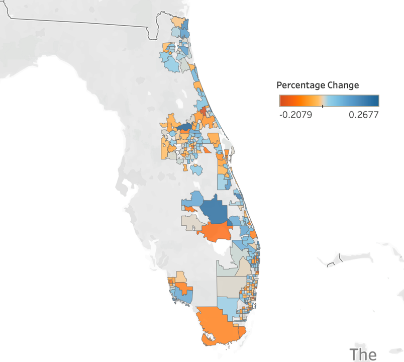
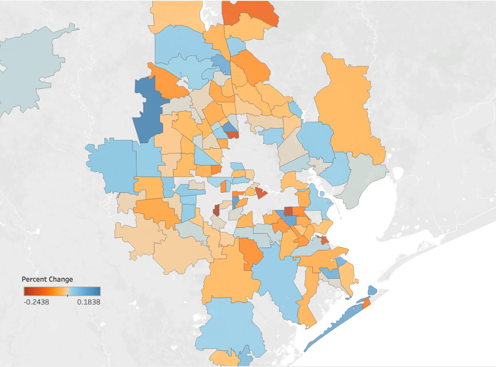

# Exploring Perceived/Actual Impact on Property Value after a Hurricane

#### This is a pro bono academic proof of concept between General Assembly DSI10-BOS and New Light Technologies.
---
## Table of Contents:
#### Directory Structure
#### Orientation
* Problem Statement
* How did we get here?
* Executive Summary
* Goals
* Limitations
#### Software/APIs/Libraries Used
* Engineering
* Web Application
* Visuals
#### Data Dictionary
#### High Level Overview of Findings
* Hurricane Dorian
* Hurricane Harvey
* Hurricane Sandy
#### Minimum Viable Product for Web Application
* Home Page of Flask App
* Results Page of Flask App
#### Next Steps and Recommendations
#### Sources/Citation
#### Contact Info
---
## Directory Structure
```
├── DSI_group_project_hurricane_impact
    ├── flask_app
        ├── static
            └── style.css
        ├── templates  
            ├── colors.html
            ├── data_frame.html
            ├── home.html
            └── land.html
        └── app_starter.py
    ├── visuals
        ├── dorian_tableau.png
        ├── harvey_tableau.png
        ├── flask_home.png
        ├── flask_results.png
        └── sandy_tableau.png
    ├── consolidated_jupyter_nb.ipynb
    ├── presentationFOOOBARRR.pdf
    └── README.md
```    
## Problem Statement

#### How did we get here? 
During a disaster, it is important to model and estimate the potential or forecasted effect of the event, including the projected/forecasted damage. Existing indicators of forecasted damage include number of structures within the affected area, number of people in the area, number of households, demographics of the impacted population, etc. This project will add an additional perspective: It will compare how hurricanes do or do not impact real estate sale prices by zip code before and after the storm.

#### How do we quickly glean insights on property values before and after a hurricane through a user friendly application?

## Executive Summary

Foo Bar
foo bar
 
## Goals
* Provide an initial proof of concept for a potential web application using Flask software for Python. 
* This rudimentary web app will allow the user to input a zip code and see summary statistics for how median real estate prices were affected after a hurricane.

## Limitations
- We used the top ~6000 zip codes by population, not the ~41000 exhaustive list of zips
- This initial proof focuses on the recent hurricanes of Sandy, Harvey, and Dorian
- Our focus for this project was financial impact on zip code aggregated median sale prices
- This project considers nominal/actual sale prices, not indirect/real economic costs

## Software/APIs/Libraries Used

#### Engineering
- Python
- Jupyter
- Pandas
- Numpy

#### Web Application
- Flask (Using Python): Flask, request, render_template, session, redirect, url_for
- Pandas
- Numpy
- Atom (For Flask, HTML, CSS)
- Sys

#### Visuals
- Tableau Public
- Jupyter
- Matplotlib: Pyplot
- Seaborn
- Missingno
- Google Slides
- Adobe Acrobat

## Data Dictionary

| Column | Description |
| --- | --- |
| **Zip** | Zip Code. |
| **Pop Rank** | Ordinal population size. 1 is the largest populated zip code, 2 is the second largest. |
| **XXXX Mean Median** | The average annual sale price of monthly median sale prices recorded for the zip code. |
| **Hurricane Affected** | 1 if the zip code was impacted by Hurricane X according to FEMA, 0 otherwise. |
| **% Change After Hurricane** | Percentage difference in median zip sale price comparing the month preceding the storm to the month following the storm.|

## High Level Overview of Findings
#### Hot colors indicate largest drops in median sale price after the hurricane
#### Cold colors indicate largest increases in median sale price after the hurricane

### Hurricane Dorian


### Hurricane Harvey


### Hurricane Sandy


## Minimum Viable Product for Web Application
 
#### Enter a zip code to see the summary statistics<br> 
### Home Page of Flask App <br>


### Results Page of Flask App for Zip Code 77071 Houston (Median Sale Price dropped ~24.4% directly after Harvey)<br>


## Next Steps and Recommendations
 
## Sources/Citation
1. <a href="https://www.zillow.com/research/data/">Zillow Median Sale Price by Zip (CSV)</a> 

2. <a href="https://www.zillow.com/browse/homes/tx/harris-county/">Zillow: Harris County, TX Zip Codes</a> 

3. <a href="https://www.fema.gov/disaster/4468">FEMA Visual and link for finding official Hurricane Dorian report</a> 

4. <a href="https://www.fema.gov/media-library-data/1572651498411-9b9527200177132f395165f7888d7a67/FEMA4468DRFL.pdf">FEMA preliminary Dorian damage report for finding affected counties</a> 

5. <a href="https://www.getzips.com/county.htm">Converting counties to zipcodes (webscraping)</a> 

6. <a href="https://www.fema.gov/disasters?field_dv2_state_territory_tribal_value_selective=All&field_dv2_incident_type_tid=49124&field_dv2_declaration_type_value=All&field_dv2_incident_begin_value%5Bvalue%5D%5Bmonth%5D=&field_dv2_incident_begin_value%5Bvalue%5D%5Byear%5D=&field_dv2_incident_end_value%5Bvalue%5D%5Bmonth%5D=&field_dv2_incident_end_value%5Bvalue%5D%5Byear%5D=">Easily searchable FEMA database for finding storms:</a> 

7. <a href="https://www.nhc.noaa.gov/news/UpdatedCostliest.pdf">NOAA.gov Hurricane Data</a> 

8. <a href="https://www.livescience.com/40774-hurricane-sandy-s-impact-infographic.html">Hurricane Sandy Damage</a> 

9. <a href="https://www.ncdc.noaa.gov/billions/">Financial Impact of Hurricanes from NOAA.gov</a> 

10.  <a href="https://fred.stlouisfed.org/series/MSPUS?utm_source=series_page&utm_medium=related_content&utm_term=related_resources&utm_campaign=categories#0">Year over Year National Sale Prices from St. Louis Federal Reserve</a> 

## Contact Info

Rose Dennis - email: rosedennis@umass.edu , github: RoseXDennis <br>
Drew Dellarocco - email: drewdellarocco@gmail.com , github: drewdellarocco <br>
Robert Becotte - email: robert.becotte@gmail.com , github: robertgerardb <br>
